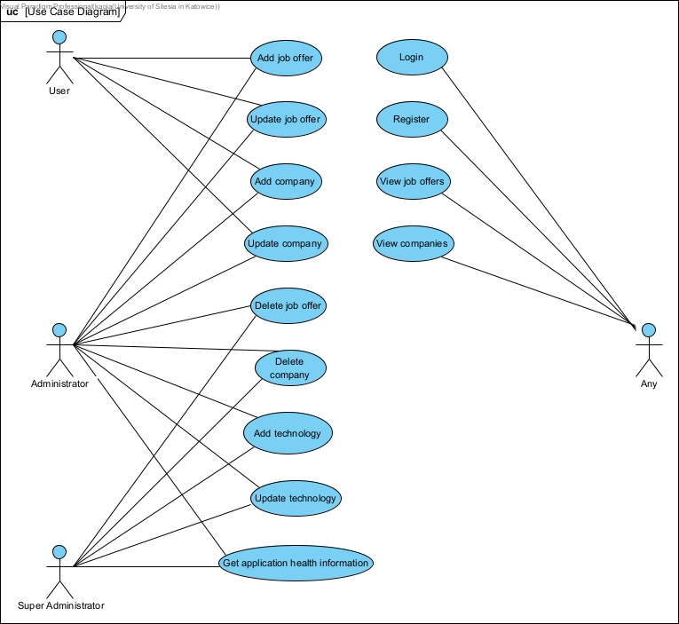
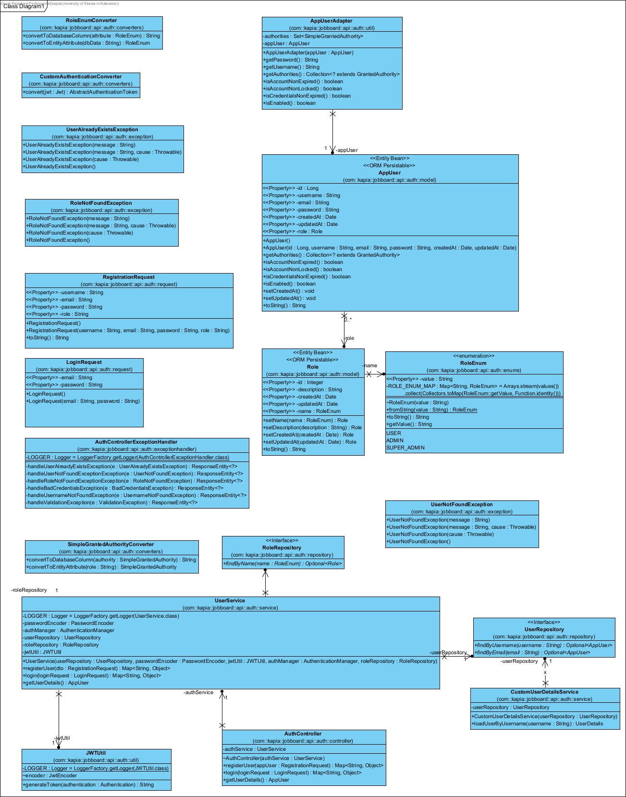
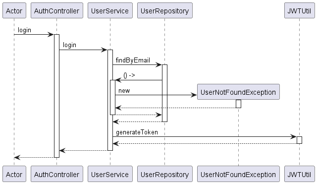

# Job board API

## Opis aplikacji

Aplikacja jest prototypem usługi backendowej dla platformy ofert pracy. Usługa zapewnia punkty końcowe do zarządzania ofertami pracy z
powiązanymi informacjami, takimi jake dane firmy. Aplikacja jest napisana w języku Java z wykorzystaniem frameworka Spring.

## Instrukcja użycia

Aplikację można uruchomić za pomocą polecenia `docker compose up` wykonanego w folderze z plikiem `docker-compose.yaml`. Aplikacja będzie dostępna pod adresem `localhost:8080`.
Pełna dokumentacja API jest dostępna pod adresem `/swagger-ui.html` lub `/v3/api-docs`. 

Do uruchomienia aplikacji wymagane jest jedynie środowisko Docker.

Zapytania do API mogą być wykonywane za pomocą narzędzi takich jak Postman lub Insomnia, lub za pomocą narzędiu `curl`. Przykładowe zapytania:

```bash

# Pobranie wszystkich ofert pracy
curl --location 'http://localhost:8080/api/v1/job-offers'

# Pobranie oferty pracy o id 1
curl --location 'http://localhost:8080/api/v1/job-offers/1'

# Dodanie nowej oferty pracy
curl --location 'http://localhost:8080/api/v1/job-offers' \
--header 'Content-Type: application/json' \
--header 'Authorization: Bearer <token>' \
--data '{
  "name": "Bitcoin Architect",
  "shortDescription": "Exciting opportunity for software engineers something!",
  "description": "We are looking for skilled software engineers to join our team. This should not be added to a database. We are looking for skilled software engineers to join our team. We are looking for skilled software engineers to join our team. We are looking for skilled software engineers to join our team. We are looking for skilled software engineers to join our team. We are looking for skilled software engineers to join our team. We are looking for skilled software engineers to join our team.",
  "contractType": "INTERNSHIP",
  "salary": 500,
  "salaryCurrency": "USD",
  "salaryType": "MONTHLY",
  "experience": "SENIOR",
  "operatingMode": "HYBRID",
  "expiresAt": "2024-05-13T00:00:00Z",
  "companyId": 170,
  "addressId": 170,
  "technologies": {
    "1": "NONE",
    "2": "NONE",
    "3": "NONE"
  }
}
'
```

## Konfiguracja

W pliku `docker-compose.yaml` można zmienić następujące parametry:

| **Environment variable**           | **Default value**                 | **Corresponding property name**    | **Description**                     |
|------------------------------------|-----------------------------------|------------------------------------|-------------------------------------|
| `JDBC_DATABASE_URL`                | jdbc:postgresql://localhost:5432/ | `spring.datasource.url`            | Database url with hostname and port |
| `JDBC_DATABASE_NAME`               | jobboard                          | `spring.datasource.url`            | Name of the database                |
| `JDBC_DATABASE_USERNAME`           | api                               | `spring.datasource.username`       | Database user username              |
| `JDBC_DATABASE_PASSWORD`           | apipassword                       | `spring.datasource.password`       | Database user password              |
| `RATE_LIMIT_BUCKET_CAPACITY`       | 100                               | `rate.limit.bucket.capacity`       | Global bucket capacity              |
| `RATE_LIMIT_REFILL_PERIOD_SECONDS` | 60                                | `rate.limit.refill.period.seconds` | Refill period for the global bucket |
| `RATE_LIMIT_REFILL_TOKENS`         | 100                               | `rate.limit.refill.tokens`         | Tokens to refill                    |
| `CACHE_INITIAL_CAPACITY`           | 100                               | `cache.initial.capacity`           | Cache initial capacity              |
| `CACHE_MAXIMUM_SIZE`               | 500                               | `cache.maximum.size`               | Maximum size of the cache           |
| `CACHE_EXPIRE_AFTER_WRITE_MINUTES` | 1                                 | `cache.expire.after.write.minutes` | Expiration time of the cache        |

*This table was generated from `application.properties` docs
using [this script](https://github.com/kapiaszczyk/python-scripts/blob/main/documentation_tools/properties_env_var_extractor.py)*


# Diagram przypadków użycia



## Diagram klas


*Ze względu na dużą ilość klas, diagram przedstawia tylko klasy z pakietu `com.example.jobboard.auth`*

## Diagram sekwencji


*Diagram przedstawia proces logowania użytkownika*

## Opis klas

Klasy w pakiecie `com.example.jobboard.data.model` reprezentują encje w bazie danych. Każda klasa odpowiada jednej tabeli w bazie danych. Klasy w pakiecie `com.example.jobboard.data.repository` są interfejsami do komunikacji z bazą danych. Klasy w pakiecie `com.example.jobboard.data.service` zawierają logikę biznesową aplikacji. Klasy w pakiecie `com.example.jobboard.data.controller` są kontrolerami REST API.

Pakiet `com.example.jobboard.data.auth` zawiera klasy odpowiedzialne za autentykację użytkowników i generowanie tokenów JWT.

Dokładny opis klas wraz z opisem metod znajduje się w dokumentacji JavaDoc w plikach źródłowych.

## Kluczowe fragmenty kodu

Metoda dodająca nową ofertę pracy:

```java
    /**
     * Adds a new job offer to the database.
     *
     * @param jobOfferDTO DTO containing the job offer data
     * @return Optional containing the basic view of the added job offer
     */
    @Transactional
    public Optional<JobOfferBasicView> add(JobOfferDTO jobOfferDTO) {

        Company company = companyRepository.findById(jobOfferDTO.getCompanyId())
                .orElseThrow(() -> new ResourceNotFoundException("Company not found"));

        Address address = addressRepository.findById(jobOfferDTO.getAddressId())
                .orElseThrow(() -> new RuntimeException("Address not found"));

        JobOffer jobOffer = new JobOffer(
                jobOfferDTO.getName(), jobOfferDTO.getShortDescription(), jobOfferDTO.getDescription(),
                jobOfferDTO.getContractType(), jobOfferDTO.getSalary(), jobOfferDTO.getSalaryCurrency(),
                jobOfferDTO.getSalaryType(), jobOfferDTO.getExperience(), jobOfferDTO.getOperatingMode(),
                jobOfferDTO.getExpiresAt(), address, company);

        jobOffer = jobOfferRepository.save(jobOffer);

        Set<JobOfferTechnology> jobOfferTechnologies = new HashSet<>();

        List<Technology> technologies = technologyRepository.findAllById(jobOfferDTO.getTechnologies().keySet());

        for (Technology technology : technologies) {
            Long technologyId = technology.getId();
            DegreeOfKnowledge degreeOfKnowledge = DegreeOfKnowledge.valueOf(jobOfferDTO.getTechnologies().get(technologyId));

            jobOfferTechnologies.add(new JobOfferTechnology(
                    new JobOfferTechnologyKey(jobOffer.getId(), technologyId),
                    jobOffer,
                    technology,
                    degreeOfKnowledge
            ));
        }

        jobOfferTechnologyRepository.saveAll(jobOfferTechnologies);
        jobOffer.setTechnologies(jobOfferTechnologies);
        jobOfferRepository.save(jobOffer);

        return jobOfferRepository.findProjectedById(jobOffer.getId());
    }

```

Metoda tworząca `Specifications` dla ofert pracy na podstawie kryteriów wyszukiwania oraz wybrane metody pomocnicze:

```java

    /**
     * Creates a job offer specification based on the search criteria.
     *
     * @param criteria search criteria
     * @return job offer specification
     */
    public static Specification<JobOffer> createJobOfferSpecification(JobOfferSearchCriteria criteria) {

        LOGGER.info("Creating job offer specification with criteria: {}", criteria.toJSON());

        return Specification.where(nameContains(criteria.getName()))
                .and(companyNameContains(criteria.getCompanyName()))
                .and(locationContains(criteria.getLocation()))
                .and(technologiesIn(criteria.getTechnologies()))
                .and(operatingModeIn(criteria.getOperatingMode()))
                .and(contractTypeIn(criteria.getContractType()))
                .and(experienceIn(criteria.getExperience()))
                .and(salaryIsBetween(criteria.getSalaryMin(), criteria.getSalaryMax()));
    }

    /**
     * Creates a specification for filtering job offers by salary range.
     *
     * @param min minimum salary
     * @param max maximum salary
     * @return specification for filtering job offers by salary range
     */
    public static Specification<JobOffer> nameContains(Optional<String> name) {
        return (root, query, builder) -> {
            return name.map(n -> builder.like(root.get("name"), "%" + n + "%")).orElse(null);
        };
    }

    /**
     * Creates a specification for filtering job offers by company name.
     *
     * @param companyName company name
     * @return specification for filtering job offers by company name
     */
    public static Specification<JobOffer> companyNameContains(Optional<String> companyName) {
        return (root, query, builder) -> {
            if (query.getResultType() != Long.class && query.getResultType() != long.class) {
                root.fetch("company", JoinType.LEFT).fetch("addresses", JoinType.LEFT);
            }
            return companyName.map(cn -> builder.like(root.get("company").get("name"), "%" + cn + "%")).orElse(null);
        };
    }

```

Klasa umożliwiająca logowanie ID wątków:

```java

/**
 * Logback converter for logging thread IDs.
 */
public class ThreadIdConverter extends ClassicConverter {
    @Override
    public String convert(final ILoggingEvent e) {
        return String.valueOf(Thread.currentThread().threadId());
    }
}
    
```

